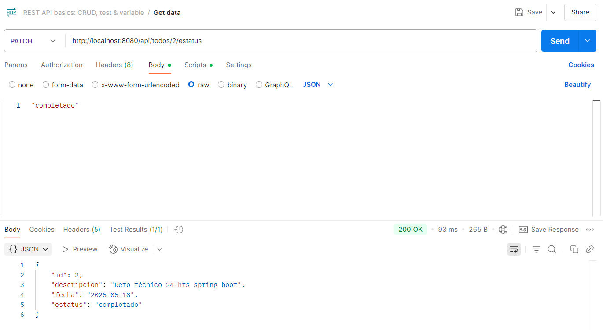

# ToDo API - Spring Boot + MySQL

Este proyecto es una API RESTful desarrollada con **Spring Boot** y conectada a una base de datos **MySQL**. Permite la gestión de tareas (ToDos), incluyendo creación, lectura, actualización, cambio de estatus y eliminación.

---

## Tecnologías utilizadas

- Java
- Spring Boot
- Spring Data JPA
- MySQL
- Maven

---

##  ¿Cómo ejecutar el proyecto localmente?

###  1. Clona el repositorio

git clone https://github.com/ArathArt/todo-api.git
cd todo-api

---

### 2. Configurar la base de datos

Crea una base de datos en MySQL llamada todo_db:

CREATE DATABASE todo_db;

---

### 3. Editar el archivo src/main/resources/application.properties

Asegúrate de que las credenciales coincidan con tu base de datos local:

spring.datasource.url=jdbc:mysql://localhost:3306/todo_db
spring.datasource.username=tu_usuario_mysql
spring.datasource.password=tu_contraseña_mysql

spring.jpa.hibernate.ddl-auto=update
spring.jpa.show-sql=true
spring.jpa.properties.hibernate.dialect=org.hibernate.dialect.MySQL8Dialect

---

### 4. Ejecutar la aplicación

En la terminal:

./mvnw spring-boot:run

Endpoints disponibles:

| Método | URL                      | Descripción                |
| ------ | ------------------------ | -------------------------- |
| POST   | `/api/todos`             | Crear un nuevo ToDo        |
| GET    | `/api/todos`             | Obtener todos los ToDos    |
| PUT    | `/api/todos/{id}`        | Actualizar un ToDo por ID  |
| PATCH  | `/api/todos/{id}/estatus` | Cambiar estatus de un ToDo |
| DELETE | `/api/todos/{id}`        | Eliminar un ToDo por ID    |

---

## Ejemplo de cuerpo JSON

### Crear o actualizar un ToDo:

{
  "descripcion": "Completar el reto técnico",
  "fecha": "2025-05-17",
  "estatus": "pendiente"
}

### Cambiar estatus (PATCH):

  "completado"

---
### Evidencias de pruebas:

  
  
  
  
  
